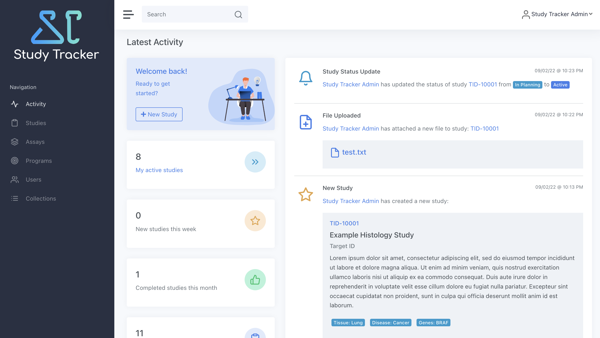

# Study Tracker


[](https://www.codacy.com/gh/Study-Tracker/Study-Tracker/dashboard?utm_source=github.com&amp;utm_medium=referral&amp;utm_content=Study-Tracker/Study-Tracker&amp;utm_campaign=Badge_Grade)
[](https://study-tracker.gitbook.io/documentation/)
[](https://app.fossa.com/projects/git%2Bgithub.com%2FStudy-Tracker%2FStudy-Tracker?ref=badge_shield)

Study Tracker makes the job of managing your team's research easier by providing a user-friendly web
application that serves as a single source-of-truth for your organization. Save time by
connecting with other required platforms, such as electronic laboratory notebooks (ELNs), data file
storage systems, and team messaging services. Integrate Study Tracker with other platforms via an
integrated REST API and event dispatcher service for sharing of data.



## Requirements

- JDK 11+
- Maven 3+
- PostgreSQL 12+
- Elasticsearch 7.10 (optional)

NodeJS and NPM are *not* required for building and running the project, as the
`frontend-maven-plugin` installs them at build time, in order to properly compile the front-end of
the application.

## Documentation

For instructions about how to configure deploy Study
Tracker, [see Gitbook](https://study-tracker.gitbook.io/documentation/).

## Supported Integrations

### Electronic Laboratory Notebook

- Benchling

### File storage

- Egnyte
- Amazon S3
- Local filesystem

### Event Management

- AWS EventBridge

### Single Sign-on

- Okta

### Source Code Management

- GitLab

## Quick Start

For a rapid build and deployment in development mode, follow the steps below. For production deployment, see the wiki.

1. Make sure you have all requirements installed.
2. Create a new PostgreSQL database.
3. Create a new file, `web/src/main/resources/application.properties`. Use the
   `application.properties.example` file as a template for filling out the required parameters for
   running the application.
4. Create a new file, `web/flyway.conf`, using the `flyway.conf.example` file as a template. Fill in
   your database's username, password, and connection URL.
5. Build the application with Maven:

    ```bash
    mvn clean package -DskipTests
    ```

6. Run the Flyway plugin to import the Study Tracker database schema and default data:

   ```bash
   mvn -Dflyway.configFiles=web/flyway.conf flyway:clean flyway:migrate
   ```

7. You can run the application with Maven from the `web` directory:

   ```bash
   mvn spring-boot:run 
   ```

   Or, you can execute the packaged WAR file directly:

   ```bash
   java -jar web/target/study-tracker.war
   ```

## Contact

For questions about Study Tracker, or if you would like to contribute, please contact:

- [Will Oemler, Vesalius Therapeutics](mailto:woemler@vesaliustx.com)

## License

Copyright 2022 the original authors

Licensed under the Apache License, Version 2.0 (the "License"); you may not use this file except in
compliance with the License. You may obtain a copy of the License at

       http://www.apache.org/licenses/LICENSE-2.0

Unless required by applicable law or agreed to in writing, software distributed under the License is
distributed on an "AS IS" BASIS, WITHOUT WARRANTIES OR CONDITIONS OF ANY KIND, either express or
implied. See the License for the specific language governing permissions and limitations under the
License.

Licensed under the Apache License, Version 2.0 (the "License"); you may not use this file except in
compliance with the License. You may obtain a copy of the License at

http://www.apache.org/licenses/LICENSE-2.0

Unless required by applicable law or agreed to in writing, software distributed under the License is
distributed on an "AS IS" BASIS, WITHOUT WARRANTIES OR CONDITIONS OF ANY KIND, either express or
implied. See the License for the specific language governing permissions and limitations under the
License.


[](https://app.fossa.com/projects/git%2Bgithub.com%2FStudy-Tracker%2FStudy-Tracker?ref=badge_large)